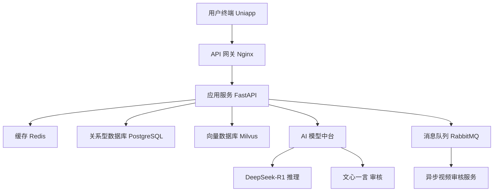

# “青研智思”高校思政智能研习平台 PRD 文档

## 文档基本信息
| 项目 | 内容 |
| :--- | :--- |
| **项目名称** | “青研智思”高校思政智能研习平台 |
| **文档版本** | V1.0.0 |
| **当前状态** | 草案 |
| **创建日期** | 2026-06-07 |
| **最后更新** | 2026-06-07 |

## 修订记录
| 版本号 | 修订日期 | 修订说明 | 修订人 |
| :--- | :--- | :--- | :--- |
| V1.0.0 | 2026-06-07 | 初始版本创建 | AI Assistant |

## 项目成员
| 角色 | 姓名 | 职责 |
| :--- | :--- | :--- |
| 项目经理 | | |
| 产品经理 | | |
| 开发工程师 | | |
| UI/UX 设计 | | |
| 测试工程师 | | |

## 相关文档链接
- [需求调研报告](#)
- [交互原型图](#)
- [UI 设计稿](#)
- [接口文档](#)

---

## 目录
- [1. 产品概述](#1-产品概述)
  - [1.1 项目背景](#11-项目背景)
  - [1.2 产品目标](#12-产品目标)
  - [1.3 项目范围](#13-项目范围)
- [2. 功能特色](#2-功能特色)
- [3. 目标用户](#3-目标用户)
- [4. 功能板块详述](#4-功能板块详述)
  - [4.1 注册与仪式引导 (Onboarding)](#41-注册与仪式引导-onboarding)
  - [4.2 智慧主页 (Home Hub)](#42-智慧主页-home-hub)
  - [4.3 视界大厅 (Video Hall)](#43-视界大厅-video-hall)
  - [4.4 研习论坛 (Study Forum)](#44-研习论坛-study-forum)
  - [4.5 订阅报刊亭 (Newsstand)](#45-订阅报刊亭-newsstand)
  - [4.6 励学系统 (Incentive System)](#46-励学系统-incentive-system)
  - [4.7 管理后台 (Admin Backend)](#47-管理后台-admin-backend)
- [5. 非功能性需求](#5-非功能性需求)
- [6. 交互设计规范](#6-交互设计规范)
- [7. 技术框架建议](#7-技术框架建议)
  - [7.1 开发栈](#71-开发栈)
  - [7.2 AI 模型选型](#72-ai-模型选型)
  - [7.3 系统架构图](#73-系统架构图)
  - [7.4 AI 智能体核心逻辑](#74-ai-智能体核心逻辑)
  - [7.5 核心数据库设计](#75-核心数据库设计)
- [8. 项目前景（预期结果）](#8-项目前景预期结果)

---

## 1. 产品概述
本项目致力于打造一款深度融合**“思政教育 + 智能体（Agent）应用”**的高校研习平台。平台不仅是一个内容聚合工具，更是一个具备感知、理解与交互能力的**智能体生态系统**。

其核心价值在于通过 AI 智能体技术，重构高校思政教育的交互模式：
*   **思政教育为魂：** 严守政治方向，整合权威资源，将宏大的理论叙事转化为易于大学生理解的个性化表达、动态交互海报与沉浸式视频流。
*   **智能应用为翼：** 利用 Agent 的个性化推理与长短期记忆能力，为每位学生配备“专属数字学伴”，实现从被动灌输到主动探索、从“人找资源”到“服务找人”的智能化跨越。

在设计理念上，平台坚持以**学生成长为中心**，通过 AI 智能体拉近师生间的数字距离，弥补传统教育中的交互断层。我们将严肃的政治学习与生动的智能交互、精准的个性化服务深度结合，旨在打造一个**有温度、有深度、可进化的新时代思政智能研习阵地**。

### 1.1 项目背景
随着数字化教育的深入发展，传统的高校思政教育面临着形式单一、互动性不足、学生参与度不高等挑战。为了响应国家关于加强和改进新形势下高校思想政治工作的号召，亟需通过数字化、智能化的手段对思政教育进行赋能，构建一个符合新时代大学生使用习惯、互动性强且具备智能辅助能力的研习平台。

### 1.2 产品目标
*   **服务在校师生：** 为学生提供便捷、有趣的思政学习环境；为教师提供高效、直观的教学管理与学生交流工具。
*   **提升教育质量：** 通过 AI 技术辅助，实现个性化学习推荐、智能笔记提取等功能，提高学习效率。
*   **增强互动粘性：** 建立师生平等的对话机制和激励体系，将思政教育融入学生的日常生活。

### 1.3 项目范围
本项目主要围绕**高校思政教育**展开，涵盖以下核心领域：
*   **内容数字化：** 整合各类思政视频、报刊、新闻资源，实现全方位的内容覆盖。
*   **智能化体系：** 引入 AI 智能体（Agent），实现智能选校、AI 寄语、AI 随堂笔记、AI 摘要及智能答疑等智能化功能。
*   **互动与激励：** 构建研习论坛、订阅体系及基于“研习能量”的励学积分系统。
*   **跨端适配：** 开发适配高校微信生态的小程序及移动端应用。

---

## 2. 功能特色
*   **专属“理响”数字学伴：** 基于 Agent 技术的思政辅导员，为每位学生提供具备政治素养、有记忆、有温度的学习陪伴，实现“陪伴式”思政引领。
- **“研习金句”AI 智能提取：** 视频研习过程中，AI 实时捕捉思想闪光点与核心理论金句，辅助学生从“泛读”转向“深悟”，精准把握思政精髓。
- **“思政 AI 30秒”极速研判：** 针对宏大理论文章与国家政策文件，提供精准的要点摘要，助力大学生快速掌握时代脉搏与政策导向。
- **“红色足迹”沉浸式书架：** 拟物化 3D 设计，将“强国号”等权威思政号转化为可交互的数字化书架，让严肃阅读焕发时代活力。
- **“理响校园”全实名严肃社区：** 建立基于实名制的思政研习论坛，通过教师权威解答与 AI 语义引导，确保思政讨论的政治性、学术性与互动性。
- **“研习能量”红色激励闭环：** 将线上思政研习成果转化为“研习能量”，挂钩校园权益与“第二课堂”学分，构建“学、思、践、悟”的正向循环激励。
- **智能政治导向预审：** 内置深耕思政语境的 AI 审核模型，确保平台所有用户上传内容（UGC）均符合正确政治导向，守护校园思政阵地安全。

---

## 3. 目标用户
*   **学生：** 进行思政学习、观看视频、参与论坛讨论、每日打卡获取积分。
*   **教师/辅导员：** 发布公告、解答学生疑惑、分享学习资源、与学生进行情感交流。
*   **管理人员：** 维护平台内容安全、管理积分商城及校内通知。

---

## 4. 功能板块详述

### 4.1 注册与仪式引导 (Onboarding)
*   **功能描述：** 为新用户提供便捷的入校注册流程，并通过具有仪式感的引导体验，建立用户对平台“科技+思政”的第一印象。
*   **功能需求：**
    *   **智能选校：** 提供全国高校数据库搜索，支持关键词匹配。
    *   **实名注册：** 填写学号、姓名、设置密码。可选绑定手机/邮箱以增强安全性。
    *   **引导仪式：** 注册成功后全屏展示“科技强国”主题动态海报。
    *   **AI 寄语：** Agent 智能体根据用户身份（如：[XX大学] [姓名] 同学）生成个性化欢迎语。
*   **界面细节：** 极简搜索框设计，阶梯式表单（分步骤展示），沉浸式全屏海报弹窗，背景采用渐变“科技蓝”。
*   **交互细节：** 搜索框支持实时联动检索；表单输入自带校验反馈；海报支持长按保存或一键分享；AI 寄语以打字机效果逐字呈现。
*   **异常处理：** 
    *   搜索无结果时，提示“未找到相关学校，请检查关键词或联系管理员”并提供反馈入口。
    *   实名校验失败（如学号格式错误），输入框变红并悬浮提示错误原因。
    *   网络断开时，阻断提交操作并弹出“网络异常，请重试”提示。

### 4.2 智慧主页 (Home Hub)
*   **功能描述：** 平台的核心流量分发中心，集成校园公告、热点新闻及个性化视频推荐，实现“思政资讯一站式获取”。
*   **功能需求：**
    *   **公告栏：** 展示老师或学校发布的最新通知，支持优先级置顶。
    *   **新闻滚动：** 顶部 16:9 区域轮播国家大事与校园热点新闻。
    *   **视频推送：** 首页下方瀑布流展示推荐视频，来源包括校方上传及强国号官方发布。
*   **界面细节：** 顶部导航集成侧边菜单键，新闻轮播图自带标题浮层，公告栏采用跑马灯效果，视频矩阵采用圆角卡片化设计。
*   **交互细节：** 点击轮播图跳转新闻详情；公告支持点击展开全文；视频卡片支持“不感兴趣”长按操作以优化推荐。
*   **异常处理：**
    *   数据加载失败时展示缺省页（Slogan + 刷新按钮）。
    *   无置顶公告时，自动收起公告栏区域。
    *   视频流触底无法加载更多时，提示“已加载全部内容”。

### 4.3 视界大厅 (Video Hall)
*   **功能描述：** 沉浸式思政视频研习空间，支持师生自主创作与官方权威发布，辅以 AI 技术提升学习深度。
*   **功能需求：**
    *   **多端发布：** 支持个人账号（学生/教师）及官方账号（校方/机构）发布思政主题视频。
    *   **审核机制：** 所有上传视频必须经过“AI 预审 + 人工终审”双重机制。
    *   **全屏交互：** 独立于主页的全屏视频流界面，支持分类（时政、宣传、国防等）。
    *   **AI 随堂笔记：** 视频播放时，AI 实时提取核心观点、金句。
    *   **本地缓存：** 支持用户将思政视频下载至本地缓存，以便在无网或弱网环境下进行研习。
    *   **互动激励：** 视频结束触发简易答题或观点分享，完成后获得“研习能量”积分（每日设有上限）。
*   **界面细节：** 采用类似抖音的竖屏沉浸式布局，右侧集成交互图标（点赞、笔记、下载/缓存、分享），底部展示 AI 实时字幕。
*   **交互细节：** 上滑切换视频；双击点赞；点击“下载”图标启动本地缓存，进度以环形百分比展示；点击“AI 笔记”侧边栏弹出记录面板。
*   **异常处理：**
    *   视频播放卡顿时，自动切换低画质或提示“网络较慢，正在加载”。
    *   存储空间不足时，提示“手机空间不足，请清理后重试”并引导至缓存管理页。
    *   审核不通过的视频，仅发布者可见，并标注驳回原因。
    *   答题中途退出不计积分，并弹出确认二次弹窗。

### 4.4 研习论坛 (Study Forum)
*   **功能描述：** 师生思想交流与学术探讨的实名社区，通过不同模式满足思政研习中的多元交互需求。
*   **功能需求：**
    *   **公开提问：** 支持用户就思政理论等公开提问。
    *   **实名发言：** 全站论坛交互均强制要求实名。
    *   **理响校园 (知乎模式)：** 侧重思政理论答疑，AI 检索相似帖子，教师回答置顶。被采纳的优质回答奖励“研习能量”。
    *   **红色足迹 (分享模式)：** 侧重实践感悟，采用图文瀑布流。点赞达一定数量可触发能量奖励。
    *   **全站搜索：** 支持关键词搜索。
*   **界面细节：** 顶部搜索框固定，分类 Tabs 切换顺滑，帖子详情页采用层级评论结构，突出“教师”身份标识。
*   **交互细节：** 点击 AI 推荐链接快速跳转相关讨论；长按评论可回复或举报；发布帖子支持添加话题标签。
*   **异常处理：**
    *   触发敏感词过滤时，发布按钮失效并高亮显示违规文字。
    *   重复发布相同内容时，提示“请勿频繁发送重复内容”。
    *   搜索无匹配项时，展示“没有找到相关讨论，去提个问吧”。

### 4.5 订阅报刊亭 (Newsstand)
*   **功能描述：** 数字化权威资讯阅览室，通过拟物化书架设计与 AI 辅助阅读，提升权威资讯的阅读体验。
*   **功能需求：**
    *   **号矩阵：** 数字化书架形式展示订阅的权威号。
    *   **AI 摘要：** 提供“AI 30秒读完”核心摘要功能。
    *   **师生共读：** 老师发起任务，完成后学生获得“研习能量”与专属荣誉印章。
*   **界面细节：** 3D 立体书架背景，模拟翻页动效，文章阅读页支持夜间模式。
*   **交互细节：** 拖拽书刊可调整书架位置；点击“AI 摘要”悬浮球弹出摘要弹窗；长按文字可生成金句海报。
*   **异常处理：**
    *   未订阅任何号时，书架展示“推荐订阅”引导页。
    *   AI 摘要生成失败时，展示“AI 正在学习中，请阅读全文”。
    *   共读任务过期后，入口置灰并标注“已结束”。

### 4.6 励学系统 (Incentive System)
*   **功能描述：** 平台的动力引擎，通过积分与荣誉体系，将学生的学习行为转化为可见的激励与荣誉。
*   **功能需求：**
    *   **能量明细：** 提供详细的“研习能量”收支记录。
    *   **强国打卡：** 每日登录签到获取积分。
    *   **研习能量：** 积分体系，支持兑换校内文创、校园流量、打印券等。
    *   **荣誉勋章：** 累计时长、能量或贡献度解锁勋章。
*   **界面细节：** 个人中心顶部展示能量进度条，勋章墙采用暗金色调，签到日历具有国风元素。
*   **交互细节：** 点击能量瓶收集积分；勋章支持点击查看解锁条件及佩戴。
*   **异常处理：**
    *   积分不足兑换时，兑换按钮置灰并提示“能量不足”。
    *   签到断签后，展示“补签”选项（需消耗特定任务）。
    *   礼品售罄时，标注“已兑完”并支持设置补货提醒。

### 4.7 管理后台 (Admin Backend)
*   **功能描述：** 为管理人员提供内容管理、用户运维及系统监控的一站式工作台。
*   **功能需求：**
    *   **内容审核：** 集中处理视频、帖子的审核队列，支持 AI 建议后的二次人工复核。
    *   **积分商城管理：** 礼品上架、库存更新、兑换码生成与发放。
    *   **通知中心：** 发布全校公告、推送系统消息。
    *   **数据大屏：** 实时展示全校研习热度、活跃度及思政学习成果分布。
*   **界面细节：** 典型的 B 端管理界面，侧边导航，支持深色模式。
*   **交互细节：** 审核操作支持批量处理；数据图表支持多维度筛选与导出。
*   **异常处理：**
    *   审核冲突（多人同时处理同一条目）时，提示“该内容正在被其他管理员处理”。
    *   敏感操作（如删除用户、发放大量积分）需二次确认并记录操作日志。

---

## 5. 非功能性需求

### 5.1 性能需求
*   **响应时间：** 首页加载时间应在 2s 以内；AI 摘要及随堂笔记生成时间应在 5s 以内。
*   **并发能力：** 系统应支持单校 5000+ 用户同时在线，并能平稳应对高峰期（如集体打卡时段）的并发冲击。
*   **稳定性：** 系统可用性应达到 99.9%，支持 7*24 小时不间断运行。

### 5.2 安全性需求
*   **内容安全：** 必须具备完善的敏感词过滤机制和 AI 自动内容审核（基于文心一言等国内模型），确保思政内容的严肃性与合规性。
- **数据安全：** 用户实名信息、学号等敏感数据必须加密存储。接口调用需进行身份鉴权（JWT/OAuth2.0）。
- **权限控制：** 严格划分学生、教师、管理人员权限，防止越权操作。

### 5.3 兼容性需求
*   **多端适配：** 完美适配主流 iOS 及 Android 移动设备，确保在微信小程序环境下的流畅运行。
*   **网络适配：** 在校园网环境下需进行专项优化，确保弱网状态下核心文字资讯的优先触达。

### 5.4 可扩展性与维护性
*   **模块化设计：** 功能模块需解耦，便于未来接入更多 AI 智能体（Agent）或校园服务插件。
*   **缓存管理：** 提供自动清理机制（如缓存超过 2GB 或 30 天未观看自动提醒/清理），确保不过度占用用户手机空间。
*   **日志监控：** 建立完善的运行日志记录与监控告警体系，快速定位并处理异常。

---

## 6. 交互设计规范
*   **主色调：** “科技蓝” (Tech Blue) + “党建红” (Party Red)。
*   **字体：** 标题使用端庄的黑体，正文使用高易读性的细黑。
*   **原则：** 严肃但不死板，强调“陪伴式”学习体验。

---

## 7. 技术框架建议

### 7.1 开发栈
*   **前端：** Uniapp (Vue3) + Pinia (状态管理) - 兼顾小程序与移动端，适配高校微信生态。
*   **后端：** Python (FastAPI) + Pydantic v2 - 高性能异步框架，完美支持 AI 模型接入。
*   **数据库：** PostgreSQL (基础业务数据) + Milvus (向量数据库，用于论坛语义搜索与知识库)。
*   **中间件：** Redis (缓存/分布式锁) + RabbitMQ (视频审核异步队列)。

### 7.2 AI 模型选型
*   **核心推理模型：** **DeepSeek-R1 / V3**。负责 AI 寄语生成、随堂笔记提取、智能答疑。
*   **内容合规模型：** **文心一言 4.0 (ERNIE Bot)**。负责全站 UGC 内容的安全审核与政治导向对齐。
*   **向量化模型：** **BGE-M3**。用于将思政文献、视频字幕向量化并存入 Milvus。

### 7.3 系统架构图


### 7.4 AI 智能体核心逻辑
**1. 专属数字学伴交互流程：**
```python
# 核心 Agent 提示词策略 (伪代码)
AGENT_SYSTEM_PROMPT = """
你是一位高校思政辅导员，具备深厚的理论功底和亲和力。
任务：根据学生的学习历史（Memory）和当前学校背景（Context），提供个性化的思政研习建议。
要求：回答需严谨且富有时代感，坚决维护政治导向。
"""

async def generate_ai_message(user_id, context):
    memory = await get_user_memory(user_id) # 获取长期记忆
    response = await deepseek.chat(
        messages=[{"role": "system", "content": AGENT_SYSTEM_PROMPT}, ...]
    )
    return response
```

**2. AI 随堂笔记提取逻辑：**
*   利用 Whisper/智谱 ASR 将视频音频转录为文本。
- 将文本按时间戳切片，调用 DeepSeek 进行关键点提取 with 金句识别。
- 最终生成包含“时间戳 + 核心观点 + 理论来源”的结构化笔记。

### 7.5 核心数据库设计
| 数据表 | 核心字段 | 说明 |
| :--- | :--- | :--- |
| **users** | id, student_id, name, school_id, password_hash | 基础用户信息 |
| **videos** | id, title, author_id, oss_url, status(审核中/通过/驳回) | 视频资源表 |
| **study_notes** | id, user_id, video_id, content_json, ai_summary | AI 生成笔记表 |
| **energy_records** | id, user_id, change_type, amount, balance | 研习能量流水表 |
| **forum_posts** | id, user_id, title, content, is_anonymous(false) | 论坛帖子表 |

---

## 8. 项目前景（预期结果）
*   **思政育人新阵地：** 预期通过智能化的研习体验，显著提升在校学生对思政学习的参与度和获得感，使思政教育从“要我学”转变为“我要学”。
- **师生关系新纽带：** 建立基于 AI 辅助的高效互动机制，弥补传统大课教学中师生交互的不足，构建更紧密的校园思想共同体。
- **教育数字化样板：** 本平台将作为高校思政教育与 AI 技术深度融合的典型案例，为“全国高校思政教育智能体平台”提供可复制、可推广的数字化转型经验。
- **数据驱动精准思政：** 通过对学生研习行为的数据分析，为学校管理层提供精准的思政教育反馈，辅助决策，提升思政工作的科学化水平。
- **可持续的红色生态：** 依托“研习能量”激励闭环，形成学习、反馈、荣誉、权益的良性生态链，确保思政教育在校园内的长效生命力。
